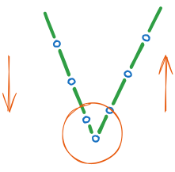
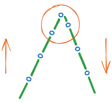

前后加固
========

前加固在一个新的线缝段开始时，由前踩调速器触发执行。

前加固的缝纫速度在参数 :option:`S03` 的限制下自动执行，中间无法被中断。如果软启动功能
同时开启，则以两者中较低的速度优先。

后加固在一个线缝段中间段任意时刻，由全后踏调速器触发执行。

倒缝会在机器停止时立刻动作。在放下缝纫压脚后，倒缝信号的接通延迟时间由参数 :option:`T06` 设
定（从压脚关断信号开始计时），之后延迟由参数 :option:`T01` 设定的时间（从倒缝接通开始计时）
后机器在启动。

针眼重合度优化
--------------

.. important::

    在调整之前，请确保机械已经校准完毕，使用倒缝扳手时正缝和倒缝针距一致。

正缝转入倒缝时出现针迹不一致的情况，调整 :option:`T01` 可以参考下面进行调整：

.. figure:: ../_static/common/add_t01.excalidraw.svg
    :scale: 150 %
    :alt: Increase T01

    增大 T01

    减小 T01

倒缝转入正缝时出现针迹不一致的情况，调整 :option:`T02` 可以参考下面进行调整：

    增大 T02

.. figure:: ../_static/common/sub_t02.excalidraw.svg
    :scale: 150 %
    :alt: Decrease T02

    减小 T02

装饰性加固
----------

装饰性加固功能，也叫 SD 模式，用于保证重合性，使线迹更好看。

不同于标准的加固程序：

- 电机在正倒缝转折点处停止
- 停留时间可以设置

当 SD 模式启用时，在加固转折点，电机会停车，并且等待 :option:`T11` 所设置的时间，确保倒缝动作到位，之后继续运行。

可以分别对前加固或者后加固启动装饰性加固，由 :option:`A20` 和 :option:`A22` 控制。

倒缝维持力度
------------

驱动倒缝电磁铁（阀）在全功率下启动。随后系统自动切换至部分功率即 PWM 控制模式，以减轻控
制系统及连接电磁铁的负载。通过参数 :option:`T08` 设置全功率持续时间，并通过
参数 :option:`O09` 设置维持力度。

.. caution::

    如果保持力设置过高，电磁阀和控制装置可能会受到永久性损坏。请遵守电磁阀的可以工作的占
    空比，并设置适当的值。

定时关断
--------

为了减少热量，尤其是当倒缝装置由电磁铁驱动的，你可以打开倒缝的定时关断功能。

如果参数 :option:`O10` 设置为1，那么倒缝最长的接通时间由参数 :option:`O11` 决定。

快速参考
--------

下表总结了前后加固功能所使用到的参数：

====================================== ====== =============
参数                                   权限   参见
====================================== ====== =============
前加固速度                             操作员 :option:`S03`
后加固速度                             操作员 :option:`S04`
装饰性前加固                           操作员 :option:`A20`
装饰性后加固                           操作员 :option:`A22`
倒缝装置从开始动作到吸合到位需要的时间 技术员 :option:`T01`
倒缝装置从开始动作到吸合到位需要的时间 技术员 :option:`T02`
装饰性加固停顿时间                     技术员 :option:`T11`
前加固后维持恒定速度                   技术员 :option:`A34`
倒缝接通角度                           技术员 :option:`D05`
倒缝关断角度                           技术员 :option:`D06`
倒缝定时关断                           技术员 :option:`O10`
倒缝最大维持时间                       技术员 :option:`O11`
1 针的限速                             技术员 :option:`O12`
2 针的限速                             技术员 :option:`O13`
3 针的限速                             技术员 :option:`O14`
前加固匀速保持针数                     技术员 :option:`O41`
全力时间                               开发者 :option:`T08`
维持出力阶段的占空比                   开发者 :option:`O09`
====================================== ====== =============

参数列表
------------

.. option:: S03

    -Max  4500
    -Min  50
    -Unit  spm
    -Description  前加固能达到的最大速度

.. option:: S04

    -Max  4500
    -Min  50
    -Unit  spm
    -Description  后加固能达到的最大速度

.. option:: A20

    -Max  1
    -Min  0
    -Unit  --
    -Description
      | 装饰性前加固：
      | 0 = 关闭；
      | 1 = 打开

.. option:: A22

    -Max  1
    -Min  0
    -Unit  --
    -Description
      | 装饰性后加固：
      | 0 = 关闭；
      | 1 = 打开

.. option:: T01

    -Max  200
    -Min  1
    -Unit  ms
    -Description  倒缝装置从开始动作到吸合到位需要的时间

.. option:: T02

    -Max  200
    -Min  1
    -Unit  ms
    -Description  倒缝装置从开始动作到释放到位需要的时间

.. option:: T11

    -Max  1000
    -Min  1
    -Unit  ms
    -Description  等待时间，装饰性加固打开的情况下，在缝纫方向转换点电机停下来等待倒缝动作到位

.. option:: A34

    -Max  1
    -Min  0
    -Unit  --
    -Description
      | 为了使线迹重合效果更好，前加固结束后维持当前加固速度，若干针后速度才由调速器接管：
      | 0 = 关闭；
      | 1 = 打开

.. option:: D05

    -Max  359
    -Min  0
    -Unit  1°
    -Description  倒缝接通角度

.. option:: D06

    -Max  359
    -Min  0
    -Unit  1°
    -Description  倒缝关断角度

.. option:: O10

    -Max  1
    -Min  0
    -Unit  --
    -Description
      | 倒缝定时关断：
      | 0 = 关闭；
      | 1 = 打开

.. option:: O11

    -Max  30
    -Min  5
    -Unit  s
    -Description  如果倒缝定时关断功能打开，倒缝最长接通时间由此参数设置

.. option:: O12

    -Max  4500
    -Min  50
    -Unit  spm
    -Description  前后加固或者折返缝一段只有 1 针时的限速

.. option:: O13

    -Max  4500
    -Min  50
    -Unit  spm
    -Description  前后加固或者折返缝一段只有 2 针时的限速

.. option:: O14

    -Max  4500
    -Min  50
    -Unit  spm
    -Description  前后加固或者折返缝一段只有 3 针时的限速

.. option:: O41

    -Max  10
    -Min  0
    -Unit  针
    -Description  前加固后保持当前速度的针数，之后速度才由调速器接管

.. option:: T08

    -Max  999
    -Min  1
    -Unit  ms
    -Description  倒缝：全力时间，:term:`时间 t1`

.. option:: O09

    -Max  100
    -Min  1
    -Unit  %
    -Description  倒缝：维持出力阶段 :term:`时间 t2` 的占空比
