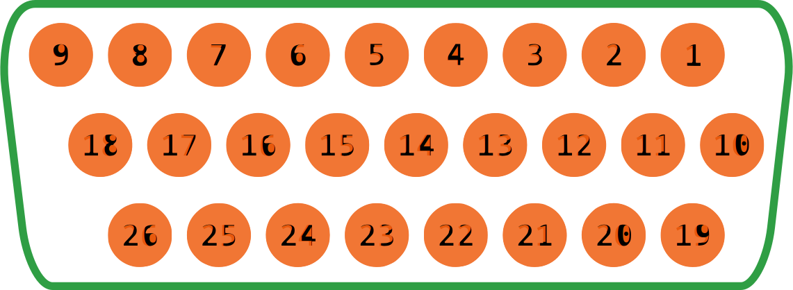

YSC-90A0
========

规格概要
--------

- 下挂独立控制箱；
- 交流220v±10%；
- 10路电磁铁（阀）输出；

控制箱接口
----------

后板接口
~~~~~~~~

引脚定义
~~~~~~~~

M1
++

    电机电源线。

    === =======
    Pin Define
    === =======
    1   EARTH
    2   A phase
    3   B phase
    4   C phase
    === =======

M1.1
++++

    电机码盘线。

    === =======
    Pin Define
    === =======
    1   GND
    2   VCC
    3   MC-U
    4   MC-W
    5   MC-CHA
    6
    7   MC-SYNC
    8   MC-V
    9   MC-CHB
    === =======

PANEL
+++++

    操作盒。

    === =======
    Pin Define
    === =======
    1
    2   CANL
    3   HMI-RXD
    4   VCC
    5   GND
    6   CANH
    7   HMI-TXD
    8   VCC
    9   GND
    === =======

PEDAL
+++++

    调速器。

    === ======== ========== ===========
    Pin Normal   Standing   SPI
    === ======== ========== ===========
    1   GND      GND        GND
    2   VCC      VCC        VCC
    3   Pedal-AN Pedal-AN   INT2
    4                       SPI-SCK
    5            Trim       SPI-MISO-IN
    6            Start/Stop INT1
    7            Foot       INT3
    8                       SPI-NSS
    9                       SPI-MOSI
    === ======== ========== ===========

X100
++++

    扩展信号端口。

    === ========
    Pin Normal
    === ========
    1   EXT-SYNC
    2   CANL
    3   UART-RX
    4   VCC
    5   GND
    6   CANH
    7   UART-TX
    8   VCC
    9   GND
    === ========

X101
++++

    信号端口。

    === ================= === =================
    Pin Define            Pin Define
    === ================= === =================
    1   VCC               14  CHA2
    2   Keypad-LOCK       15  Machine ID-SDA
    3   Machine ID-SCL    16  Input-06(digital)
    4   Keypad-CLK        17  Input-05(digital)
    5   CHB2              18  Input-02(digital)
    6   Input-04(digital) 19  DC12v
    7   Input-03(digital) 20  DC12v
    8   ElecHandWheel-CHB 21  Input-10(analog)
    9   ElecHandWheel-CHA 22  Input-09(analog)
    10  GND               23  Input-08(analog)
    11  GND               24  Input-07(analog)
    12                    25  Keypad-KEY
    13  Keypad-DATA       26  Input-01(digital)
    === ================= === =================

X200
++++

    电磁铁（阀）输出端口。

    === ========= === =========
    Pin Define    Pin Define
    === ========= === =========
    1   DC31v     14  Output-04
    2   Output-02 15  Output-05
    3   Output-01 16  Output-06
    4   Output-03 17  Output-07
    5   Output-04 18  Output-10
    6   Output-05 19  DC31v
    7   Output-06 20  Output-02
    8   Output-07 21  Output-01
    9   Output-10 22  DC31v
    10  DC31v     23  Output-09
    11  Output-02 24  Output-09
    12  Output-01 25  Output-08
    13  Output-03 26  Output-08
    === ========= === =========

机头集线器B35-8A
----------------

集线器接口图示
~~~~~~~~~~~~~~

引脚定义（连接至控制箱）
~~~~~~~~~~~~~~~~~~~~~~~~

J11
+++

.. figure:: ../_static/90a0/hub8A/J11.png
    :scale: 100 %

    连接至 X200

    === ========= === =========
    Pin Define    Pin Define
    === ========= === =========
    1   Output-04 2   Output-04
    3   Output-05 4   Output-05
    5   Output-06 6   Output-06
    7   Output-07 8   Output-07
    9   Output-10 10  Output-10
    11  Output-09 12  Output-09
    13  Output-08 14  Output-08
    === ========= === =========

J14
+++

.. figure:: ../_static/90a0/hub8A/J14.png
    :scale: 100 %

    连接至X200

    === ========= === =========
    Pin Define    Pin Define
    === ========= === =========
    1   DC31v     2   DC31v
    3   DC31v     4   DC31v
    5   Output-02 6   Output-02
    7   Output-01 8   Output-02
    9   Output-01 10  Output-01
    11  Output-03 12  Output-03
    === ========= === =========

J12
+++

.. figure:: ../_static/90a0/hub8A/J12.png
    :scale: 100 %

    连接至 X101

    === ================= === =================
    Pin Define            Pin Define
    === ================= === =================
    1   Input-01(digital) 2   Input-07(analog)
    3   Input-10(analog)  4   Input-05(digital)
    5   Input-09(analog)  6   Input-03(digital)
    7   CHB2              8   Input-06(digital)
    9   CHA2              10  Input-08(analog)
    11                    12  GND
    13  DC12v             14  DC12v
    === ================= === =================

J15
+++

.. figure:: ../_static/90a0/hub8A/J15.png
    :scale: 100 %

    连接至 X101

    === ================= === =================
    Pin Define            Pin Define
    === ================= === =================
    1   VCC               2   Machine ID-SCL
    3   Machine ID-SDA    4   Input-02(digital)
    5   Input-04(digital) 6   Keypad-KEY
    7   ElecHandWheel-CHB 8   Keypad-CLK
    9   ElecHandWheel-CHA 10  Keypad-LOCK
    11  GND               12  Keypad-DATA
    === ================= === =================

引脚定义（连接至外设）
~~~~~~~~~~~~~~~~~~~~~~

J3
++

.. figure:: ../_static/90a0/hub8A/J3.png
    :scale: 100 %

    典型应用：电磁阀。

    === ====== === =========
    Pin Define Pin Define
    === ====== === =========
    1   DC31v  2   Output-08
    3   DC31v  4   Output-09
    5   DC31v  6   Output-10
    7   DC31v  8   Output-07
    9   DC31v  10  Output-06
    11  DC31v  12  Output-05
    13  DC31v  14  Output-04
    15         16
    === ====== === =========

J6
++

.. figure:: ../_static/90a0/hub8A/J6.png
    :scale: 100 %

    典型应用：电磁铁。

    === ========= === ======
    Pin Define    Pin Define
    === ========= === ======
    1   Output-02 2   DC31v
    3   Output-01 4   DC31v
    5   Output-03 6   DC31v
    === ========= === ======

J1
++

.. figure:: ../_static/90a0/hub8A/J1.png
    :scale: 100 %

    典型应用：机头热键盒。

    === ============== === =================
    Pin Define         Pin Define
    === ============== === =================
    1   VCC            2   Keypad-DATA
    3   GND            4   Keypad-LOCK
    5                  6   Keypad-CLK
    7   Machine ID-SDA 8   Keypad-KEY
    9   Machine ID-SCL 10  Input-02(digital)
    === ============== === =================

J2
++

.. figure:: ../_static/90a0/hub8A/J2.png
    :scale: 100 %

    典型应用：电子手轮。

    === =================
    Pin Define
    === =================
    1   GND
    2   ElecHandWheel-CHA
    3   ElecHandWheel-CHB
    4   Input-04(digital)
    5
    === =================

J5
++

.. figure:: ../_static/90a0/hub8A/J5.png
    :scale: 100 %

    典型应用：交互量自动限速传感器。

    === ================
    Pin Define
    === ================
    1   VCC
    2   GND
    3   Input-07(analog)
    4
    === ================

J8
++

.. figure:: ../_static/90a0/hub8A/J8.png
    :scale: 100 %

    典型应用：膝控开关。

    === =================
    Pin Define
    === =================
    1   Input-05(digital)
    2   GND
    === =================

J9
++

.. figure:: ../_static/90a0/hub8A/J9.png
    :scale: 100 %

    典型应用：机头灯，机头倾倒传感器。

    === =================
    Pin Define
    === =================
    1   VCC
    2   Input-03(digital)
    3   GND
    === =================

J4
++

.. figure:: ../_static/90a0/hub8A/J4.png
    :scale: 100 %

    典型应用：护眼传感器。

    === =================
    Pin Define
    === =================
    1
    2   Input-06(digital)
    4   GND
    === =================

J7
++

.. figure:: ../_static/90a0/hub8A/J7.png
    :scale: 100 %

    典型应用：旋梭盖板保护传感器。

    === =================
    Pin Define
    === =================
    1
    2
    3   Input-01(digital)
    4   GND
    5   DC12v
    === =================
