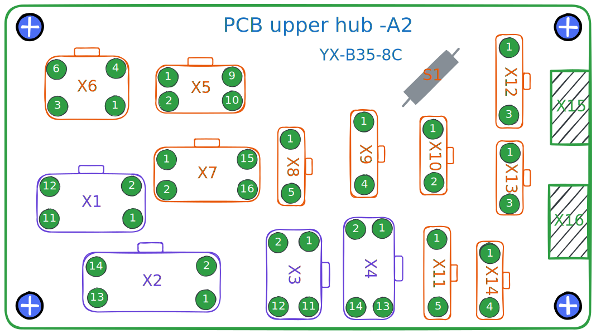

# 机头集线板（YX-B35-8C）

适配的控制器型号：

- 90A0

适配的机器型号：

- AK-82867

## 规格参数

112mm x 58mm

## 总览

## 连接至控制箱

**X1** 和 **X2** 连接至控制箱背板 **X200** 接口；
**X3** 和 **X4** 连接至控制箱背板 **X101** 接口。

### X1

| 引脚 | 定义      | 引脚 | 定义      |
| ---- | --------- | ---- | --------- |
| 1    | DC31v     | 2    | DC31v     |
| 3    | DC31v     | 4    | DC31v     |
| 5    | Output-02 | 6    | Output-02 |
| 7    | Output-01 | 8    | Output-02 |
| 9    | Output-01 | 10   | Output-01 |
| 11   | Output-03 | 12   | Output-03 |

### X2

| 引脚 | 定义      | 引脚 | 定义      |
| ---- | --------- | ---- | --------- |
| 1    | Output-04 | 2    | Output-04 |
| 3    | Output-05 | 4    | Output-05 |
| 5    | Output-06 | 6    | Output-06 |
| 7    | Output-07 | 8    | Output-07 |
| 9    | Output-10 | 10   | Output-10 |
| 11   | Output-09 | 12   | Output-09 |
| 13   | Output-08 | 14   | Output-08 |

### X3

| 引脚 | 定义               | 引脚 | 定义              |
| ---- | ------------------ | ---- | ----------------- |
| 1    | VCC                | 2    | Machine ID-SCL    |
| 3    | Machine ID-SDA     | 4    | Input-02(digital) |
| 5    | Input-04(digital)  | 6    | Keypad-KEY        |
| 7    | Elec Handwheel-CHB | 8    | Keypad-CLK        |
| 9    | Elec Handwheel-CHA | 10   | Keypad-LOCK       |
| 11   | GND                | 12   | Keypad-DATA       |

### X4

| 引脚 | 定义              | 引脚 | 定义              |
| ---- | ----------------- | ---- | ----------------- |
| 1    | Input-01(digital) | 2    | Input-07(analog)  |
| 3    | Input-10(analog)  | 4    | Input-05(digital) |
| 5    | Input-09(analog)  | 6    | Input-03(digital) |
| 7    | CHB2              | 8    | Input-06(digital) |
| 9    | CHA2              | 10   | Input-08(analog)  |
| 11   | -                 | 12   | GND               |
| 13   | DC12v             | 14   | DC12v             |

## To peripherals

### X5

默认用途：热键盒。

| 引脚 | 定义           | 引脚 | 定义              |
| ---- | -------------- | ---- | ----------------- |
| 1    | VCC            | 2    | Keypad-DATA       |
| 3    | GND            | 4    | Keypad-LOCK       |
| 5    |                | 6    | Keypad-CLK        |
| 7    | Machine ID-SDA | 8    | Keypad-KEY        |
| 9    | Machine ID-SCL | 10   | Input-02(digital) |

### X6

默认用途：各类执行装置，尤其是由电磁铁驱动的。

| 引脚 | 定义      | 引脚 | 定义  |
| ---- | --------- | ---- | ----- |
| 1    | Output-02 | 2    | DC31v |
| 3    | Output-01 | 4    | DC31v |
| 5    | Output-03 | 6    | DC31v |

### X7

默认用途：各类执行装置，比如电磁阀或者电磁铁。

| 引脚 | 定义  | 引脚 | 定义      |
| ---- | ----- | ---- | --------- |
| 1    | DC31v | 2    | Output-08 |
| 3    | DC31v | 4    | Output-09 |
| 5    | DC31v | 6    | Output-10 |
| 7    | DC31v | 8    | Output-07 |
| 9    | DC31v | 10   | Output-06 |
| 11   | DC31v | 12   | Output-05 |
| 13   | DC31v | 14   | Output-04 |
| 15   | -     | 16   | -         |

### X8

默认用途：电子手轮。

| 引脚 | 定义               |
| ---- | ------------------ |
| 1    | GND                |
| 2    | Elec Handwheel-CHA |
| 3    | Elec Handwheel-CHB |
| 4    | Input-04(digital)  |
| 5    | -                  |

### X9

默认用途：安装于交互量轮盘内的电位器。

| 引脚 | 定义             |
| ---- | ---------------- |
| 1    | VCC              |
| 2    | GND              |
| 3    | Input-07(analog) |
| 4    | -                |

### X10

默认用途：膝控开关。

| 引脚 | 定义              |
| ---- | ----------------- |
| 1    | Input-05(digital) |
| 2    | GND               |

### X11

默认用途：旋梭盖板检测传感器。

| 引脚 | 定义              |
| ---- | ----------------- |
| 1    | -                 |
| 2    | -                 |
| 3    | Input-01(digital) |
| 4    | GND               |
| 5    | DC12v             |

### X12

默认用途：机头倾倒传感器，机头 LED 灯的 5v 电源供电。

| 引脚 | 定义              |
| ---- | ----------------- |
| 1    | VCC               |
| 2    | Input-03(digital) |
| 3    | GND               |

### X13

默认用途：机针护眼传感器。

| 引脚 | 定义              |
| ---- | ----------------- |
| 1    | -                 |
| 2    | Input-06(digital) |
| 3    | GND               |

### X14

默认用途：润滑油位检测传感器。

| 引脚 | 定义              |
| ---- | ----------------- |
| 1    | VCC               |
| 3    | -                 |
| 3    | Input-08(digital) |
| 4    | GND               |
